# Manual Tests

[Go Back to README.md](https://github.com/Stuartpkd/Tarraing)

## Epic 1: Core Website Functionality (Needed features)

[1](https://github.com/Stuartpkd/Tarraing/issues/1) - As a registered user, I can upload my artwork so that I can share them with the community.

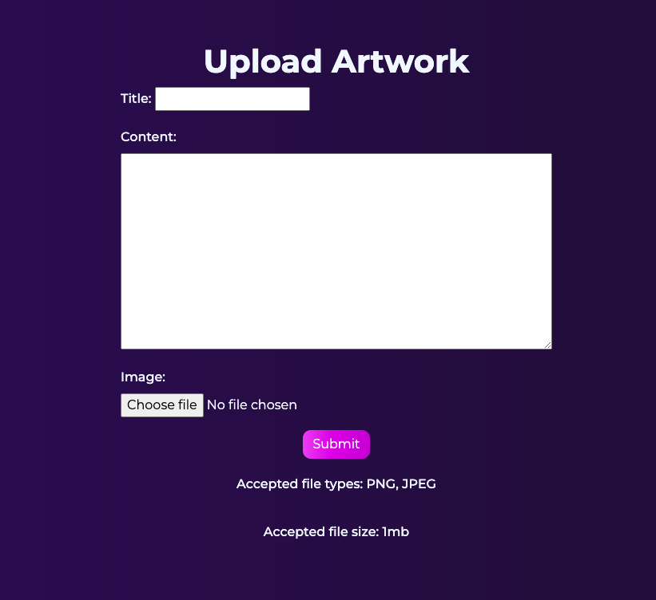
\
&nbsp;

This photo shows the upload page where the user can navigate to create their post.

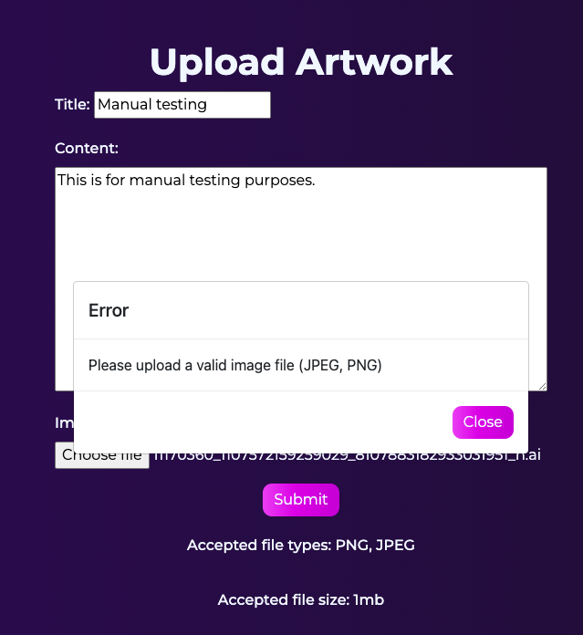
\
&nbsp;

The file type warning is made whenever the user uploads anything that isnt a png or a jpeg.

\
&nbsp;

This warning is issued when the user provides a file that is too large. (Over 1mb)

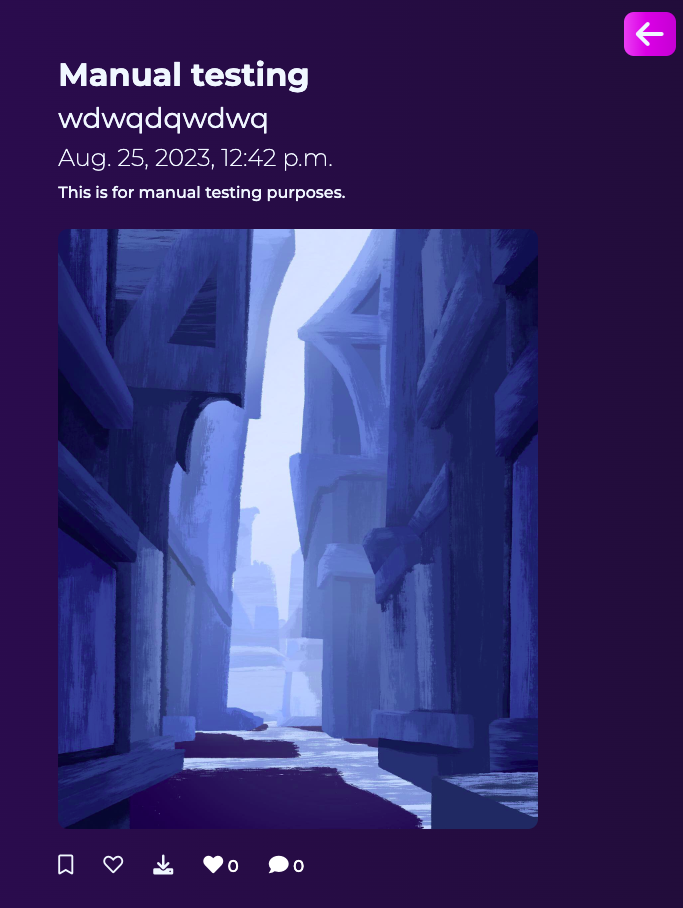

Here is when the user is brought to their post detail of their upload upon a successful upload.

\
&nbsp;

This user story is met on the upload page, which can be navigated to through the nav. The upload page details the dile types and sizes that it accepts and will show a warning box if the user tries to break them. The user is also warned on the page which file types and sizes are accepted. Upon a successful upload, the user is brought to the post detail of their post.
\
&nbsp;

[2](https://github.com/Stuartpkd/Tarraing/issues/2) - As a registered user, I can delete my uploaded artwork so that I can remove unwanted artwork from the site.

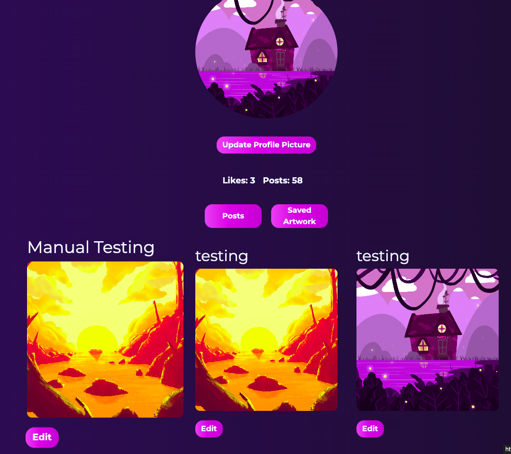

This image shows the profile page where a user has navigated to delete one of their posts.

\
&nbsp;

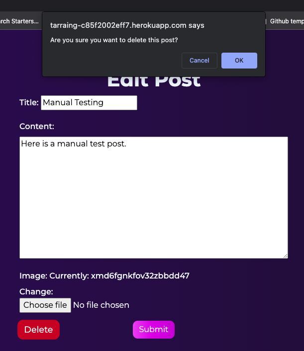

After pressing edit they a brought to a page where they are able to then press delete to remove the post. This also shows a warning incase the user changes their mind.

\
&nbsp;

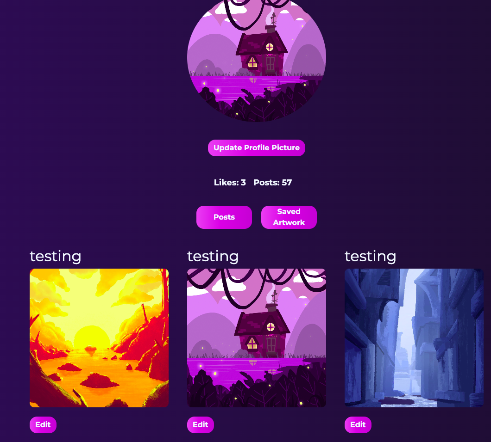

Here the user has been redirected to their profile page after deleting their post.

\
&nbsp;

This user story is met on the edit post section of the site. This can be navigated to by going to your user profile page and pressing edit on the post container. They may then press delete on the post which will remove it from the site. There is also a warning displayed in case the user changes their mind. If they choose to delete it, they are redirected to their profile page.
\
&nbsp;

[3](https://github.com/Stuartpkd/Tarraing/issues/3) - As a registered user, I can update the information and files of my uploaded artwork to reflect any changes or improvements.

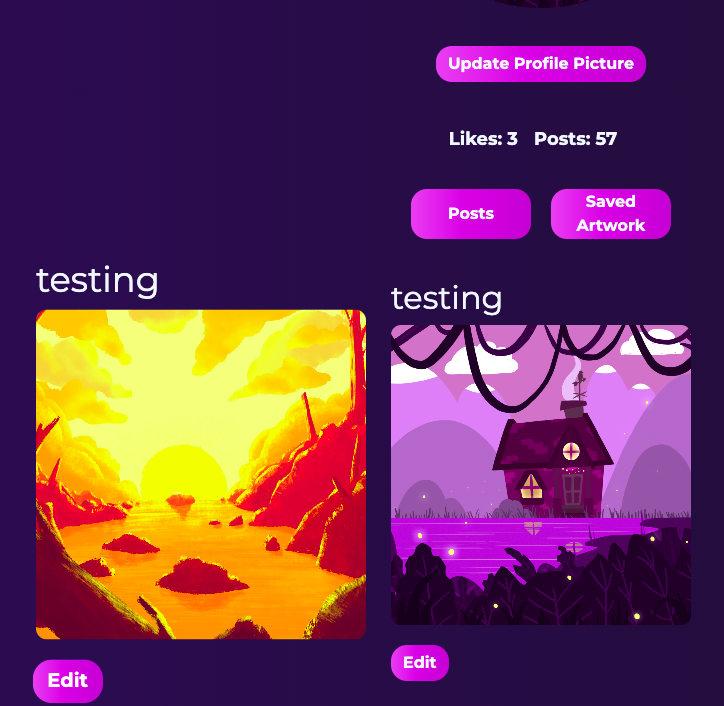

Here the user has again navigated to their profile to edit their post. 

\
&nbsp;

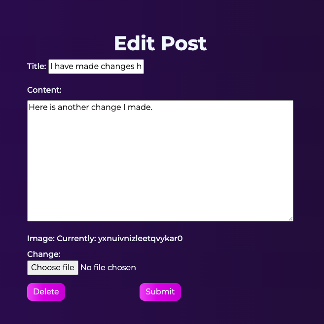

On this screen they can change the image, title and content of the post.

\
&nbsp;

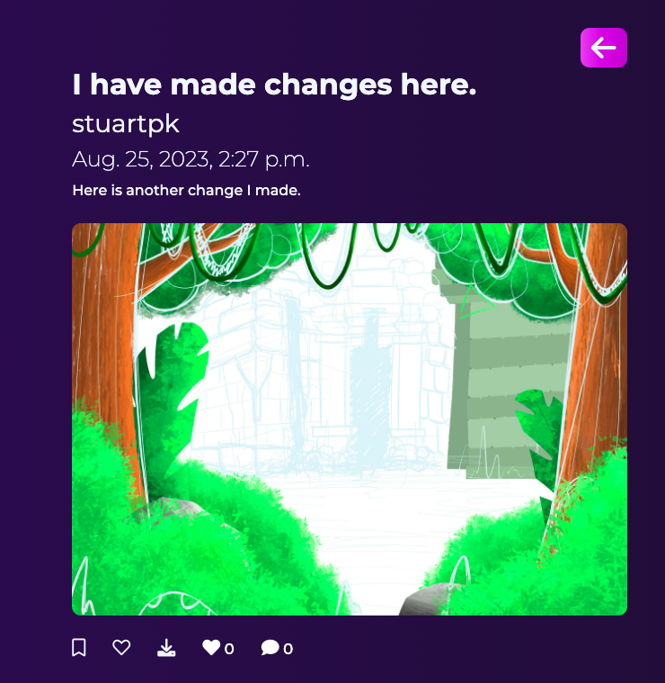
\
&nbsp;

Here they are then redirected to the post detail to see their changes.

This user story is met on the edit post section of the site. This can be navigated to by going to your user profile page and pressing edit on the post container. The user is then able to update the title, content and image of their post. Upon submitting these changes the user is brought to the post detail page with their changes made. 
\
&nbsp;

[4](https://github.com/Stuartpkd/Tarraing/issues/4) - As a registered user, I can like artwork that I find interesting or inspiring to show my appreciation.

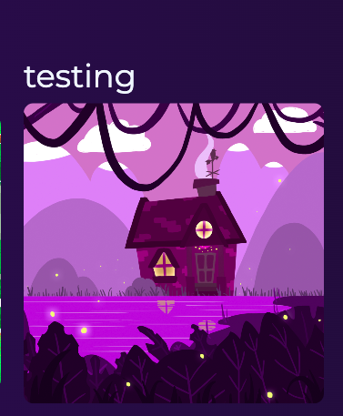

Here the user sees a post they like and click on the post detail.

\
&nbsp;

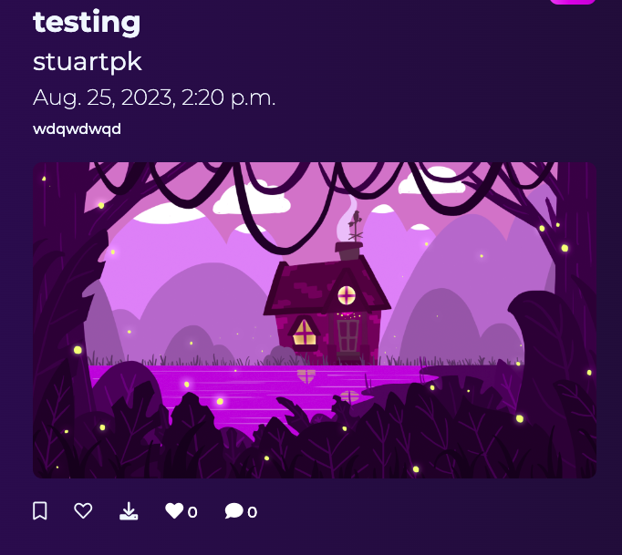
\
&nbsp;

Here the user has gone to the post detail and has seen the like button under the page and has pressed it.

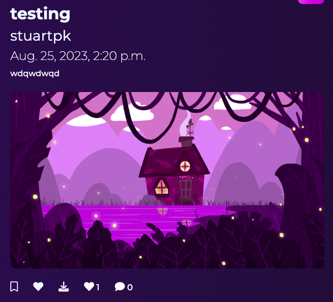

Here the icon has changed to show feedback that their like was recorded.

\
&nbsp;

This user story is met by navigating to a post detail page of a post that a user likes. They can then click on the like button which then changes its icon to show that it has been liked by the user. The user is also able to unlike the post if they wish to do so.
\
&nbsp;

[8](https://github.com/Stuartpkd/Tarraing/issues/8) - As a site user, I can search for specific artwork using keywords or filters to discover relevant content.

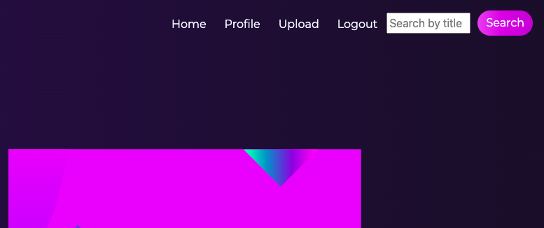

Here this user has naviagted to the top of the site to find the search bar.

\
&nbsp;

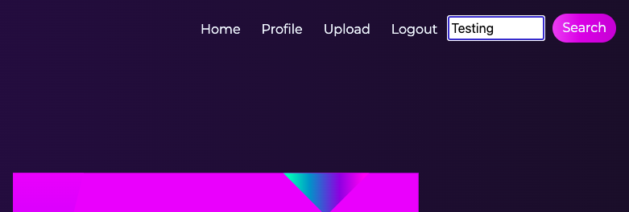

Here the user has entered a query they would like to search for. 

\
&nbsp;

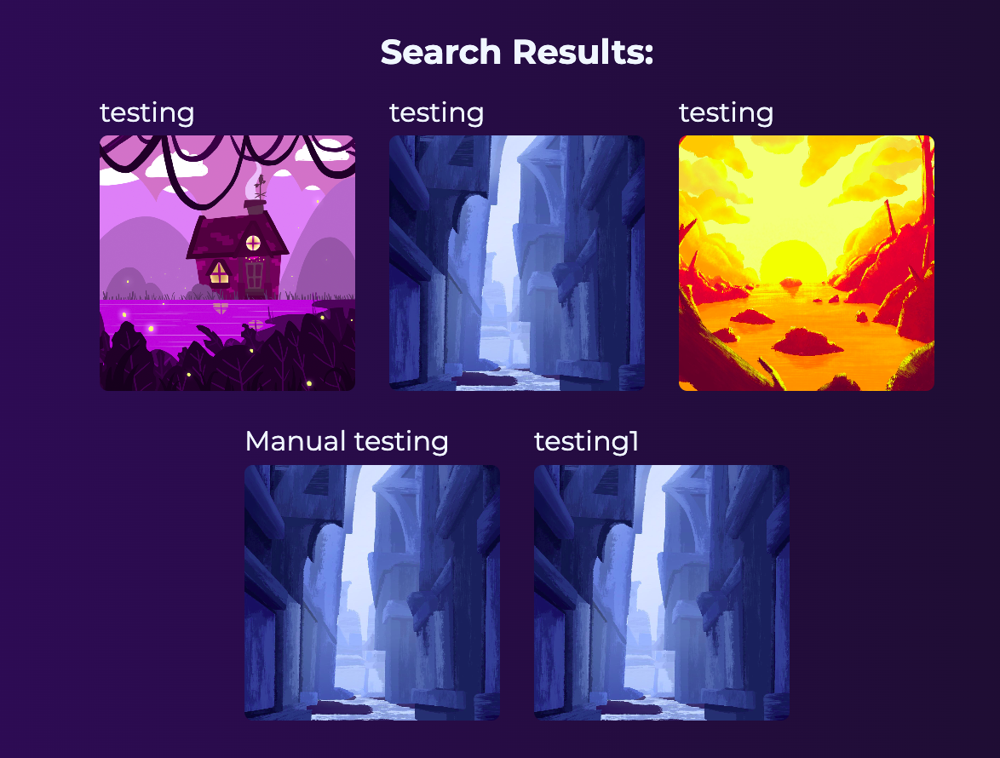

Here the results are then shown to the user.

\
&nbsp;

This user story is met by navigating to the search menu at the top of the screen in the nav bar. The search query is based on the title of posts and will look for keywords that the user enters. The user is also warned when there were no search results for their query. The user is also able to use this feature anywhere in the site, once authenticated.
\
&nbsp;

[9](https://github.com/Stuartpkd/Tarraing/issues/9) - As a site user, I can click on an artwork to view its details, including the title, description, artist and upload date so that I can learn further about the content.

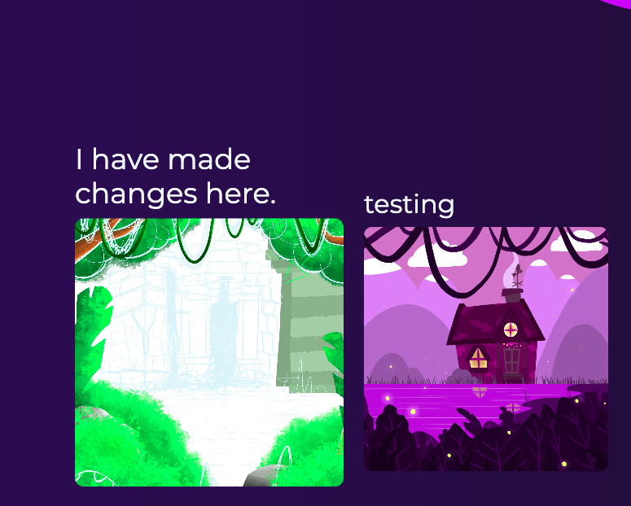

Here the user has found a post they are interested in.

\
&nbsp;

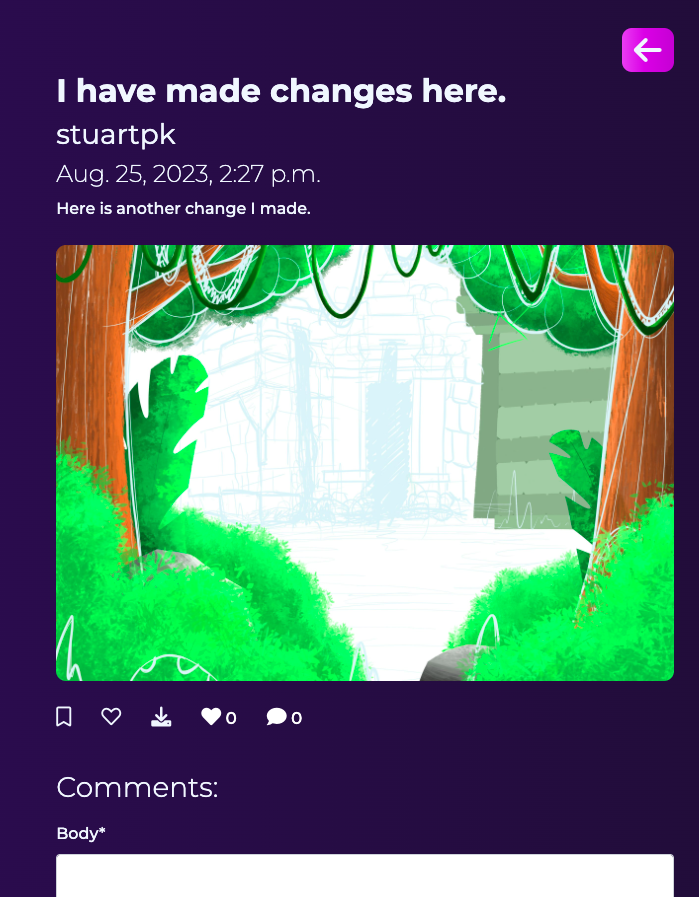

Here they have made their way to the post detail where they can see further information on the post.

\
&nbsp;

This user story is met by clicking on any post link to be brought to its post detail page. It will contain the users name, the upload date, comment section, likes, a download button and a description. The user may also return to the home page by clicking on the back button found at the top of the post detail page.
\
&nbsp;

[11](https://github.com/Stuartpkd/Tarraing/issues/11) - As a registered user, I have a profile page where I can view and manage my uploaded artwork, as well as see my saved posts, likes and other profile-related information.

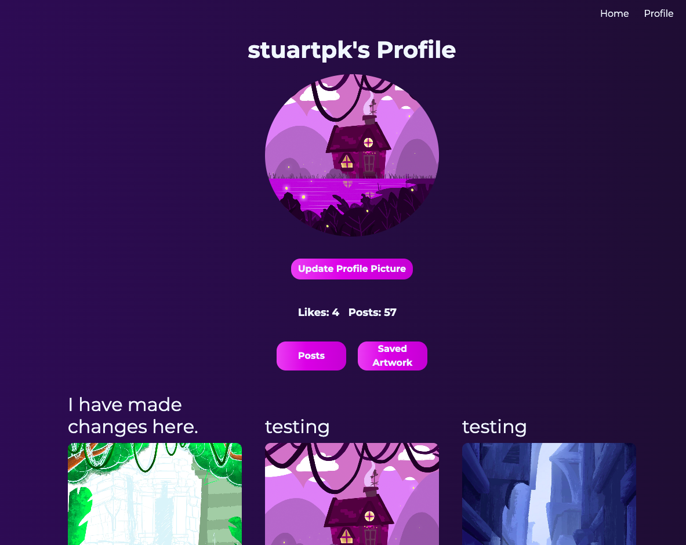

Here the user has made their way to their profile page to view their saved artworks and uploads.

\
&nbsp;

This user story is met by navigating to the profile page from the nav at the top of the screen. It will contain their uploads and their saved artworks, with a switch to toggle between the two. It also contains a count of their likes and uploads as well as a section for them to upload a profile picture. A user can also click on another users name in a post detail to view their uploads.
\
&nbsp;

[12](https://github.com/Stuartpkd/Tarraing/issues/12) - As a site user, I can register for an account or log in using my credentials to access the full features of the site and interact with other users so that I can benefit from the full features of the site.

Here the user is going to make their way to the signup / login page.

\
&nbsp;

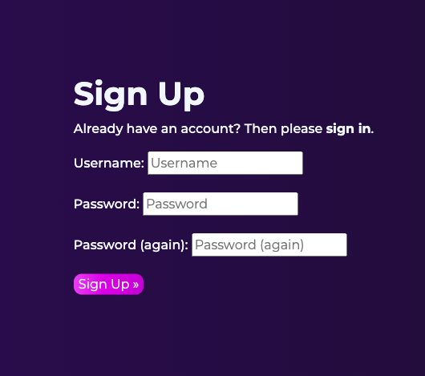

Here the user is a first time user and is making their account.

\
&nbsp;

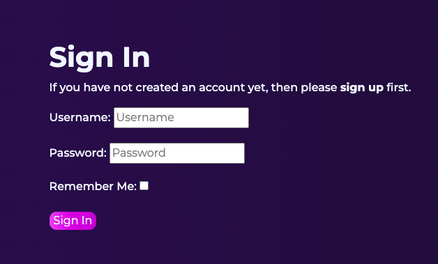

This is a returning user signing in to their account.

\
&nbsp;

Here is the home page when you are signed in.

\
&nbsp;

This user story is met by checking if the user is authenticated apon arriving to the home page. If the user is not signed in the hero section will have a button asking them to sign up. The user is able to view the posts, however will be asked to sign up / in upon trying to visit the post details or use the search function. Parts of the nav are also not rendered if the user is not signed in.
\
&nbsp;

[13](https://github.com/Stuartpkd/Tarraing/issues/13) - As an admin, I have special privileges and permissions to moderate user-generated content and manage users so that I can ensure the overall quality and integrity of the site.

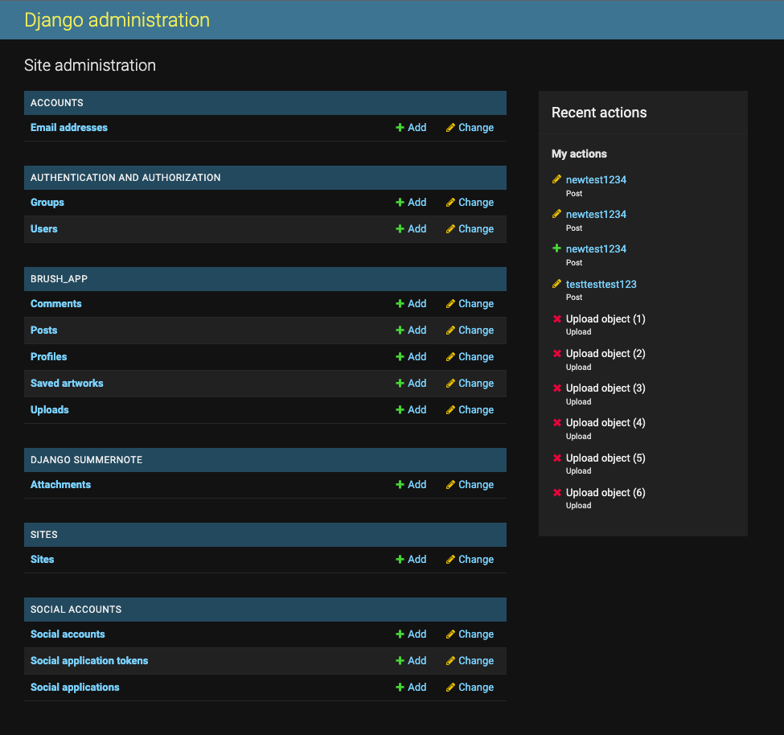

Here is an image of the django admin panel that the super user is able to access.

\
&nbsp;

This user story is met by creating a super user through the terminal. This account had special privileges to access the admin panel to manage and moderate site content. From here the admin or super user is capable of changing or removing anything from the site. This could be comments, posts, images, users etc.
\
&nbsp;

[14](https://github.com/Stuartpkd/Tarraing/issues/14) - As a registered user, I can leave comments on artwork to provide feedback or engage in discussions with other users.

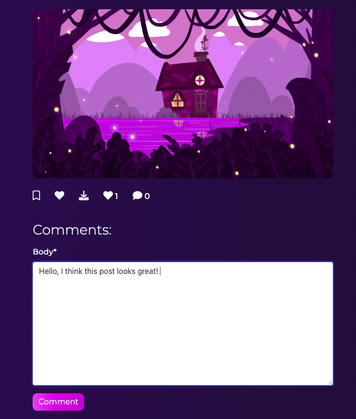

Here is user is creating a comment on a post they like.

\
&nbsp;

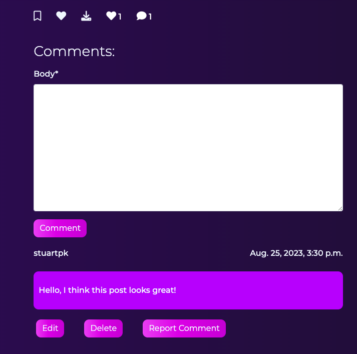

Here the user has posted the comment and it has appeared below the post.
\
&nbsp;

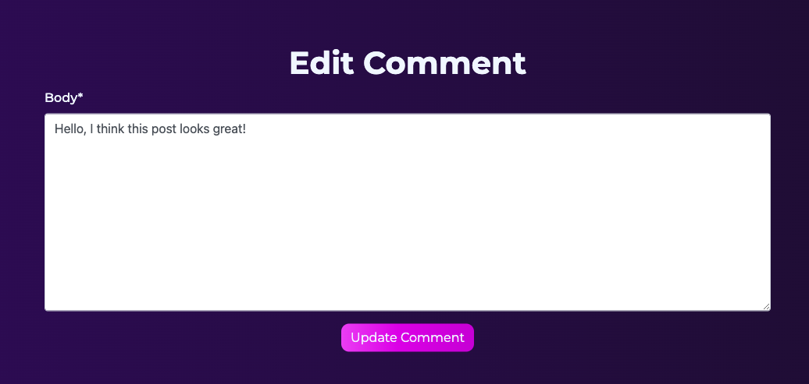

Here the user is able to edit their comment if they wish.

\
&nbsp;

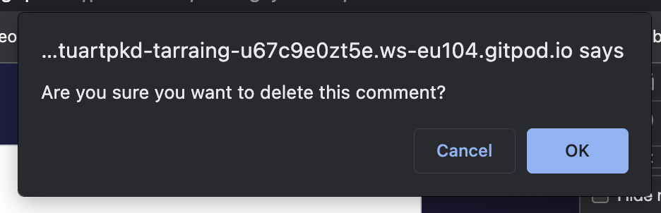

They are also able to delete their comment from the post as well.

\
&nbsp;

This user story is met by navigating to a post detail and scrolling below to see the comment section. The user is able to make a comment which then appears below the post. The comment shows the user who made it and the date it was made on. As well as the body of the comment they created. The user can also edit and delete their comment should they wish. They are also warned below the comment on how many characters the comment can take.
\
&nbsp;

## Epic 2: Secondary features (Nice to haves)

[6](https://github.com/Stuartpkd/Tarraing/issues/6) - As a registered user, I can add artwork to my saved artwork on my profile to collect and discover other artists on the site.

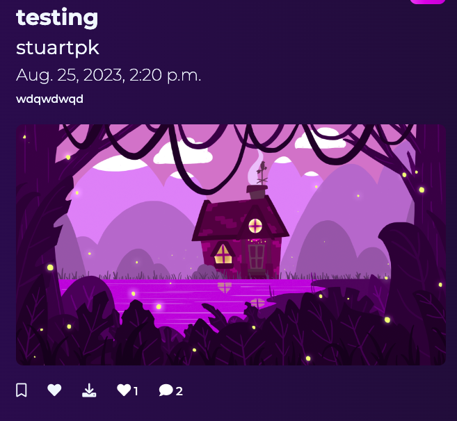

Here the user has seen the save artwork icon.
\
&nbsp;

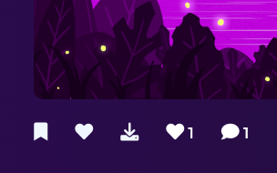

They then click on it and the icon changes to provide feedback.
\
&nbsp;

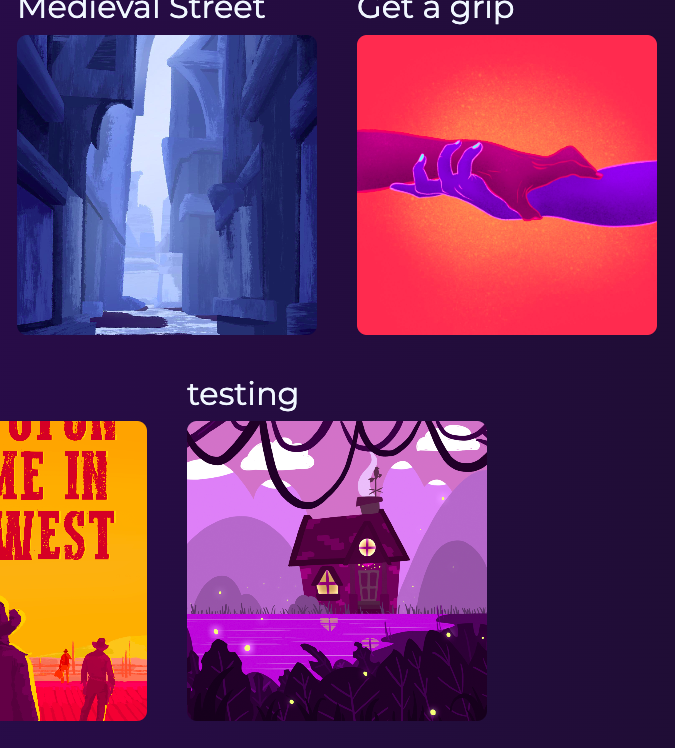

They can then view their saved artwork on their profile page.
\
&nbsp;

This user story was met by navigating to a post detail of a post and then selecting the save icon underneith the artwork. The user can then navigate to their profile page to view their saved artworks with the switch provided. The page opens with their uploads by default when going to the profile page. The user can remove the post from their saved posts by navigating to the post detail and clicking on the save button again.
\
&nbsp;

[15](https://github.com/Stuartpkd/Tarraing/issues/15) - As a user I can use the random post feature so that I can discover new artists.

Here a registered user is prompted to discover new artists by being brought to a random post detail.

\
&nbsp;

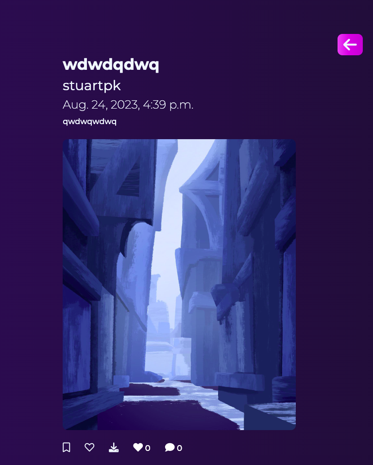

Here is the random post they were brought to.

\
&nbsp;

This user story was met by having a button in the hero section that will bring a user to a random post so that they can discover a new artist. 
\
&nbsp;

[16](https://github.com/Stuartpkd/Tarraing/issues/16) - As a user I can report a comment so that I can help maintain the friendly sense of community on the site.

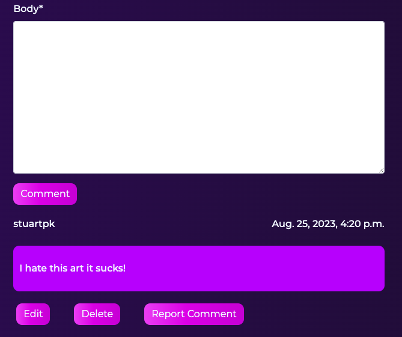

Here the user has found a hurtful comment on a post.

\

&nbsp;
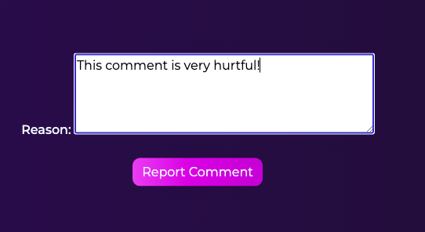

Her the user is providing a reason as to why the comment is reported.

\

&nbsp;
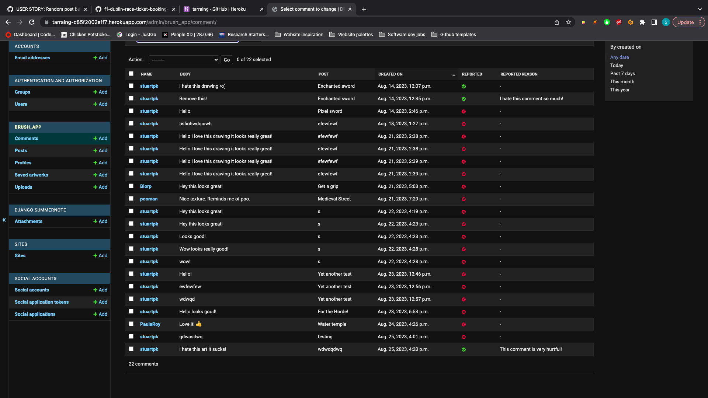

Here the admin has been notified of a comment that has been reported, along with its reason.

\
&nbsp;

This user story is met by having the report comment button below all comments made. This will bring the user to a report page. Here they can provide a reason for the comment being offensive. This will then notify the admin by marking the comment with a tick in the admin panel as well as the reason as to why it was reported. They are then able to take action.
\
&nbsp;

# Base template

## Navbar Testing

1. **Logo and Home Navigation**:  
    - Click on the "Tarraing" logo on the navbar.
    - Ensure it redirects to the home page.

2. **Lottie-Player Animation**:  
    - Verify that the Lottie animation next to the logo loads correctly and plays smoothly.

3. **Navbar Collapse**:  
    - Resize the window to a small width.
    - Click on the navbar toggler (hamburger icon).
    - Check that it expands and collapses the navbar correctly.

4. **Authenticated and Unauthenticated Views**:  
    - When logged in, the navbar should show "Profile", "Upload", and "Logout" options.
    - When not logged in, it should show a "Login/Register" option.
    - Verify these show up as intended.

5. **Search Functionality**:  
    - Test the search bar by entering various queries.
    - Click the "Search" button.
    - Confirm that it redirects to the appropriate search result page and displays relevant posts.

---

## Main Content Testing

1. **Content Rendering**:  
    - Ensure that the main content renders correctly between `` and ``.
    - This will depend on what the content should be for each specific page.

---

## Footer Testing

1. **Social Media Icons**:  
    - In the footer, click on each social media icon (Twitter, Facebook, Instagram).
    - Verify that these are linked correctly and redirect to their respective social media platforms.

2. **Visual Elements**:  
    - Ensure that all text, icons, and layout in the footer display correctly and are responsive on different screen sizes.

---

## General Testing

1. **Responsiveness**:  
    - Test the entire webpage on various device sizes to ensure that it's fully responsive.

2. **Browser Compatibility**:  
    - Test the page on multiple browsers (Chrome, Firefox, Safari, Edge, etc.) to ensure cross-browser compatibility.

3. **Page Load Time**:  
    - Measure how long it takes for the page to load fully.
    - It should load within a reasonable time frame, typically under 2-3 seconds for most broadband connections.

4. **Script Functionality**:  
    - Ensure that all scripts linked at the bottom of the HTML file function as expected.

# Edit comment page

### Authenticated User View

1. **Form Rendering**
    - Verify that the Edit Comment form is displayed correctly for authenticated users.
    - Check for form fields, labels, and buttons.

2. **Update Comment Button**
    - Fill in the form with valid and invalid data, then click the "Update Comment" button.
    - Verify that the comment is updated with valid data, and an error message is displayed for invalid data.

3. **CSRF Token**
    - Ensure that the CSRF token is generated for each session to protect against CSRF attacks.

### Unauthenticated User View

1. **Sign-in Warning**
    - Verify that an unauthenticated user sees a warning message: "Please create an account or login to view this content."

2. **Sign Up Button**
    - Verify that the "Sign Up" button is visible and redirects to the Sign Up page when clicked.

### Both Views

1. **Page Layout**
    - Check that the page layout appears centered, including the form and buttons.

2. **Responsiveness**
    - Test the page on multiple screen sizes to verify that it's fully responsive.

3. **Crispy Forms**
    - Check that Django's crispy forms tags are rendering forms well, providing better styling automatically.

4. **Error Messages**
    - Try to submit the form without filling it out, make sure appropriate error messages are displayed.

# Edit post

### For Authenticated Users

1. **Form Rendering**
    - Verify that the Edit Post form renders correctly for authenticated users. 
    - Check that all form fields, labels, and buttons appear as intended.

2. **Submit Button**
    - Fill the form with both valid and invalid data, then click the "Submit" button.
    - Ensure that the post gets updated when the data is valid.
    - Verify that an error message is displayed for invalid data submission.

3. **Delete Button**
    - Verify that the "Delete" button is present and functions as intended.
    - Ensure a confirmation is required before the post is actually deleted.

4. **CSRF Token**
    - Confirm that CSRF tokens are generated for each form to protect against CSRF attacks.

5. **Error Modal**
    - Trigger the error modal by submitting invalid data or simulating a server error.
    - Ensure the modal displays the correct error message and can be dismissed.

### For Unauthenticated Users

1. **Sign-in Warning**
    - Verify that an unauthenticated user sees a warning message: "Please create an account or login to view this content."

2. **Sign Up Button**
    - Ensure the "Sign Up" button is visible and redirects to the Sign Up page when clicked.

### JavaScript Functionality

1. **Form Submission via Fetch API**
    - Make sure the JavaScript fetch API is correctly sending the form data.
    - Check for console logs indicating fetch errors and non-JSON responses.
  
2. **Modal on Error**
    - Verify that the error modal is triggered via JavaScript when an error occurs. Check that the modal displays the correct error message.

### General Checks

1. **Layout**
    - Confirm that the page layout is responsive and elements are centered properly.

2. **Cross-browser Testing**
    - Test the page functionality across multiple browsers to ensure compatibility.

# Index

### Hero Section

1. **Hero Title**
    - Verify that the hero title "Discover and Share Digital Art" is displayed prominently.
    
2. **Hero Content**
    - Confirm the hero content is a concise description of the platform and its benefits.
    
3. **Button Behavior**
    - If the user is authenticated, verify that a "Surprise Me" button is present and functional.
    - If the user is not authenticated, ensure that a "Sign Up" button is visible and redirects to the sign-up page when clicked.

### Post List

1. **Post Container**
    - Confirm that each post is contained within its designated container with the title visible at the top.
    
2. **Artwork Image**
    - Validate that the artwork image for each post is displayed correctly.
    - If the post does not have an artwork image, confirm that a placeholder image is used.
    
3. **Post Title**
    - Check that clicking on the post title or image navigates the user to the post details page.
    
### Page Pagination

1. **Page Count**
    - Verify the displayed page number and total page count are correct.
    
2. **Navigation Buttons**
    - Ensure that the "first", "previous", "next", and "last" buttons are present and functional.
    - Confirm that these buttons correctly navigate between pages.
    - Check that these buttons are disabled when the user is on the first or last page.
    
### For Authenticated Users

1. **Personalization**
    - Verify that authenticated users see a "Surprise Me" button in the hero section.

### For Unauthenticated Users

1. **Sign-Up Redirection**
    - Verify that unauthenticated users are prompted with a "Sign Up" button in the hero section.
    
### General Checks

1. **Layout and Responsiveness**
    - Confirm that the layout is visually pleasing and responsive on different screen sizes.

2. **Cross-browser Testing**
    - Test the page functionality across multiple browsers to ensure compatibility.

# Post detail

### For Authenticated Users

#### Post Details

1. **Navigation Arrow**
    - Verify that the back arrow at the top right corner takes you back to the homepage.
    
2. **Post Title, Author, and Date**
    - Confirm that the post title, the name of the author, and the creation date are displayed correctly.
  
3. **Post Content**
    - Validate that the post's content is correctly displayed below the post title and author.

4. **Artwork Image**
    - Verify that the artwork image displays correctly.
    - If there's no image, make sure a placeholder image is shown.

#### Interaction Buttons

1. **Save Post**
    - Confirm that the save/unsave post function works correctly.
    
2. **Like Post**
    - Ensure that the like/unlike function updates the like count and icon state correctly.

3. **Download Button**
    - Verify that the download button downloads the artwork correctly.
    
4. **Like and Comment Count**
    - Confirm that the like and comment counts are correctly displayed and updated.

#### Comments Section

1. **Comments Display**
    - Verify that comments are correctly displayed with the username and timestamp.

2. **Add Comment**
    - Confirm that adding a comment works and the comment appears without requiring a page reload (if you're using AJAX).
    
3. **Edit and Delete Comment**
    - Validate that editing and deleting comments work as expected.

4. **Report Comment**
    - Confirm that the report comment function works correctly.

### For Unauthenticated Users

1. **Sign-in Warning**
    - Confirm that unauthenticated users are presented with a message that prompts them to sign in or sign up.

### General Checks

1. **Layout and Responsiveness**
    - Validate that the layout is clean and responsive on various screen sizes.
  
2. **Cross-browser Testing**
    - Ensure that the functionality works correctly across different web browsers.

# Profile

### Profile Picture

- Profile picture displays correctly for authenticated users.
- Placeholder image appears if no profile picture is set.
- "Update Profile Picture" button is visible only to the profile owner and redirects correctly to the update page.

### Username Display

- The username of the profile owner is displayed correctly in a header.

### Posts and Saved Artwork Switch

- JavaScript toggles work correctly:
  - Clicking the "Posts" button shows the posts and hides the saved artwork.
  - Clicking the "Saved Artwork" button shows the saved artwork and hides the posts.

### Likes and Posts Count

- The total number of likes and posts displays correctly.

### Post List

- Posts are displayed correctly for authenticated users.
  - Title and image are visible.
  - Edit button appears only for posts by the currently logged-in user and redirects to the correct edit page.

### Saved Artwork List

- Saved artwork is displayed only to the profile owner.
  - Title and image for each saved artwork are displayed correctly.

### Authentication Checks

- For unauthenticated users:
  - Warning message displays correctly.
  - "Sign Up" button is visible and redirects to the correct registration page.

### Responsiveness

- The page layout remains coherent and usable on large/medium/small screen resolutions.

# Report comment

### Form Display

- The form to report a comment is displayed correctly in the center of the page.

### CSRF Token

- CSRF token is generated for the form, ensuring security.

### Hidden Fields

- Hidden fields for `post_id` and `slug` are generated correctly.
- The values for these fields are populated appropriately from the comment and its related post.

### Form Fields

- All form fields display as expected.
- Form validation works, giving appropriate error messages for invalid input.

### Submit Button

- "Report Comment" button is centered and visible.
- Clicking the button submits the form, triggering the report action.

### Responsiveness

- The layout remains coherent and usable on large/medium/small screen resolutions.

# Search page

### User Authentication Check

- A user authentication check is performed.
- Non-authenticated users are redirected to a Sign-Up/Login message and button.

### Search Result Display

#### For Authenticated Users:

- The page title "Search Results:" is centered and displayed at the top.
- Posts matching the search query are displayed in a container.

#### For Each Post:

- Post title (`{{ post.title }}`) is displayed.
- An image (`{{ post.artwork_image.url }}`) is displayed if available.
  - If not, a placeholder image is used.
- Posts are clickable, redirecting to the detailed view of the post (``).

#### For No Results:

- If there are no matching results, a message "No posts found matching the search query." is displayed in the center of the page.

### Responsiveness

- The layout remains coherent and usable on large/medium/small screen resolutions.

# Upload form

### User Authentication Check

- A user authentication check is performed.
- Non-authenticated users are redirected to a Sign-Up/Login message and button.

### Upload Artwork Form

#### For Authenticated Users:

- The title "Upload Artwork" is displayed at the top of the page and is center-aligned.
  
#### Form Fields

- Form is displayed with all required fields.
- CSRF Token is included for security.
  
#### File Type and Size Information

- Below the form, the accepted file types "PNG, JPEG" are displayed.
- The maximum accepted file size "1mb" is also displayed.

#### Error Modal

- An Error Modal is present, which will be displayed if there's an error during submission.

### JavaScript Functionality

- Form submission is managed through JavaScript, specifically the `submit` event listener.
- AJAX is used for form submission, expecting a JSON response.
- If an error occurs, the Error Modal will be displayed with the error message.
- If successful, it will redirect to the URL specified in the `redirect_url` JSON field.

### Responsiveness

- The layout remains coherent and usable on large/medium/small screen resolutions.

# Profile picture

### Page Layout

- The page extends from a base HTML layout (`base.html`).

### Heading

- The heading "Upload Profile Picture" is prominently displayed and is center-aligned.

### Upload Form

#### CSRF Protection

- CSRF token is included for form security.

#### Form Fields

- The form is displayed with all required fields using `{{ form.as_p }}`.

#### Button

- A 'Upload' button is provided at the bottom of the form, center-aligned.
  
### Responsiveness

- The layout remains coherent and usable on large/medium/small screen resolutions.
  
### File Types and Size Limit

> **Note:** Information about accepted file types and size limit should ideally be displayed but is not in the given code snippet. Ensure that this is handled either on the backend or client side to inform the user.
  
### Form Submission Method

- The form uses `POST` method for submission and supports `multipart/form-data` for file uploads.

* [Back to README](https://github.com/Stuartpkd/Tarraing/tree/main)

