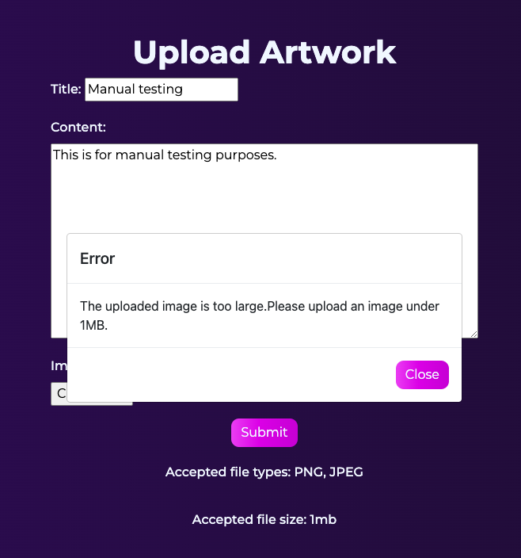

# Manual Tests

[Go Back to README.md](https://github.com/Stuartpkd/Tarraing)

## Epic 1: Core Website Functionality (Needed features)

[1](https://github.com/Stuartpkd/Tarraing/issues/1) - As a registered user, I can upload my artwork so that I can share them with the community.

\
&nbsp;

\
&nbsp;

\
&nbsp;

\
&nbsp;

This user story is met on the upload page, which can be navigated to through the nav. The upload page details the dile types and sizes that it accepts and will show a warning box if the user tries to break them. The user is also warned on the page which file types and sizes are accepted. Upon a successful upload, the user is brought to the post detail of their post.
\
&nbsp;

[2](https://github.com/Stuartpkd/Tarraing/issues/2) - As a registered user, I can delete my uploaded artwork so that I can remove unwanted artwork from the site.

\
&nbsp;

This user story is met on the edit post section of the site. This can be navigated to by going to your user profile page and pressing edit on the post container. The may then press delete on the post which will remove it from the site. There is also a warning displayed in case the user changes their mind.