# Tarraing - Digital Art Sharing Site.

## Introduction

This is my coding repository dedicated to the Tarraing website. It is a digital art sharing site for people interested in sharing and learning further about digital art. Originally, the idea for Tarraing was for users to be able to share digital art brushes with each other. However due to scoping limits I had to cut that feature. As it was going to be a dificult task hosting these brush files on Cloudinary.

[Visit the Website Here](https://tarraing-c85f2002eff7.herokuapp.com/)

[Visit the Project's GitHub Repository Here](https://github.com/Stuartpkd/Tarraing)

# Table of Contents

# Table of Contents
1. [Introduction](#introduction)
   - [Purpose](#purpose)
   - [Target Audience](#target-audience)
   - [Objectives](#objectives)
2. [User Experience (UX)](#user-experience)
   - [User Stories](#user-stories)
   - [Design Choices](#design-choices)
   - [Wireframes](#wireframes)
3. [Features](#features)
   - [Implemented Features](#implemented-features)
   - [Future Features](#future-features)
4. [Data Models](#data-models)
5. [Technologies Used](#technologies-used)
   - [Languages](#languages)
   - [Tools](#tools)
   - [Styling](#styling)
   - [Validation](#validation)
   - [Databases](#databases)
6. [Testing](#testing)
   - [Code Validation](#code-validation)
     - [W3C HTML Validator](#w3c-html-validator)
     - [W3C CSS Validator](#w3c-css-validator)
     - [JS Hint](#js-hint)
     - [CI Python checker](#ci-python-checker)
     - [Lighthouse](#lighthouse)
   - [Responsiveness](#responsiveness)
7. [Bugs](#bugs)
   - [Bug 1: SVG glitches](#bug-1-svg-glitches)
   - [Bug 2: Placeholder issue](#bug-2-placeholder-issue)
   - [Bug 3: Comment duplication](#bug-3-comment-duplication)
   - [Bug 4](#bug-4)
   - [Bug 5](#bug-5)
   - [Bug 6](#bug-6)
   - [Bug 7](#bug-7)
   - [Known bugs](#known-bugs)
8. [Deployment](#deployment)
   - [Create Application](#create-application)
   - [ElephantSQL](#elephantsql)
   - [Cloudinary](#cloudinary)
   - [Final Repo Preparations](#final-repo-preparations)
   - [Heroku Deploy](#heroku-deploy)
9. [Credits](#credits)
   - [For Code Help and Advice](#for-code-help-and-advice)
   - [Helpful Resources](#helpful-resources)
   - [For Content and Code](#for-content-and-code)

# UX / UI

The UX or User Experience centers on the website's accessibility and its level of user-friendliness, both of which play a critical role in determining the website's overall success.

These can be made up of 5 layers:

The Strategy Plane
The Scope Plane
The Structure Plane
The Skeleton Plane
The Surface Plane

## Strategy 

After thinking about the strategy for my site. I came up with a target audience, which would influence the features included.

### Target users:

1. 18-40 years old.
2. Interested in digital art.
3. People interested in the sharing of digital art.
4. People interested in discovering new digital artists.
5. People interested in collecting digital artwork.

### What the user would look for:

* A clean and visually appealing site, that does not distract from the artwork.
* A simple and clean site (Easy to navigate).
* A quick and easy way to share their artwork.
* A way to interact with other users of the site.
* A way to collect and save their favourite posts.
\
&nbsp;

### User Stories

| id  |  Content | Label |
| ------ | ------ | ------ |
| [1](https://github.com/Stuartpkd/Tarraing/issues/1) | As a registered user, I can upload my artwork so that I can share them with the community. | Needed |
| [2](https://github.com/Stuartpkd/Tarraing/issues/2) | As a registered user, I can delete my uploaded artwork so that I can remove unwanted artwork from the site. | Needed |
| [3](https://github.com/Stuartpkd/Tarraing/issues/3) | As a registered user, I can update the information and files of my uploaded artwork to reflect any changes or improvements. | Needed |
| [4](https://github.com/Stuartpkd/Tarraing/issues/4) | As a registered user, I can like artwork that I find interesting or inspiring to show my appreciation. | Needed |
| [6](https://github.com/Stuartpkd/Tarraing/issues/6) | As a registered user, I can add artwork to my saved artwork on my profile to collect and discover other artists on the site. | Nice to have |
| [8](https://github.com/Stuartpkd/Tarraing/issues/8) | As a site user, I can search for specific artwork using keywords or filters to discover relevant content. | Needed |
| [9](https://github.com/Stuartpkd/Tarraing/issues/9) | As a site user, I can click on an artwork to view its details, including the title, description, artist and upload date so that I can learn further about the content. | Needed |
| [11](https://github.com/Stuartpkd/Tarraing/issues/11) | As a registered user, I have a profile page where I can view and manage my uploaded artwork, as well as see my saved posts, likes and other profile-related information. | Needed |
| [12](https://github.com/Stuartpkd/Tarraing/issues/12) | As a site user, I can register for an account or log in using my credentials to access the full features of the site and interact with other users so that I can benefit from the full features of the site.| Needed |
| [13](https://github.com/Stuartpkd/Tarraing/issues/13) | As an admin, I have special privileges and permissions to moderate user-generated content and manage users so that I can ensure the overall quality and integrity of the site. | Needed |
| [14](https://github.com/Stuartpkd/Tarraing/issues/14) | As a registered user, I can leave comments on artwork to provide feedback or engage in discussions with other users. | Needed |
| [15](https://github.com/Stuartpkd/Tarraing/issues/15) | As a user I can use the random post feature so that I can discover new artists. | Nice to have |
| [16](https://github.com/Stuartpkd/Tarraing/issues/16) | As a user I can report a comment so that I can help maintain the friendly sense of community on the site. | Nice to have |

\
&nbsp;
## Scope
During the creation of the project, it came to my attention that the media management system I had settled on was not viable for the files I wanted to upload. A digital brush file contains an alpha matte (An image of a texture used for the brush). As well as some code that is particular to Photoshop and Procreate. Cloudinary would not accept this type of file unless I went through a complicated process of converting the brush files for Cloudinary. With keeping my minimal viable product in mind I decided to axe the brush sharing feature of the site and leave it for a future project or sprint. 

In being just a digital art sharing site, I believe it still fulfilled its inital goal of allowing digital art enthusiasts to interact and share artwork with each other. Some naming conventions will still retain some brush themes, so please keep that in mind.
\
&nbsp;

### Sprint 1
This sprint covered the needed basic features of the site, as well as the evaluation crtieria.
* A homepage that shows users posts in a paginated order.
* Navbar allowing the user to access the pages of the site.
* A register/login page for new users and returning ones.
* An upload page that allows users to create and share posts.
\
&nbsp;

### Sprint 2
This sprint builds on Sprint 1:
* Add more features to creating a post, allowing users to customise each one they make.
* Add more defensive programming, to make sure users who have not signed up are not able to access all pages.
* Add a "surprise me" feature, allowing users to discover random posts.
\
&nbsp;

### Future Sprints
Elements to add to the site in the future:
* Add the feature of brush sharing and uploading.
* Incorporate email confirmation.
* Allow user to recover their password if they forget.
* I would also like users to be able to reply to specific comments.
\
&nbsp;

## Structure

A carefully planned project structure guarantees a more organized approach to project creation, enabling a smoother adherence to sprint steps. As a result, content was segmented into applications to address diverse tasks, while data collected from users was structured into database tables for efficient organization and storage.
\
&nbsp;

### Project Applications
For this project, 1 application was created:
* brush_app – Please forgive the confusing name convention. At the time of cutting the brush uploading from the project, it would have hurt the project to rename some of the naming conventions. So some file names will recall the brush uploading idea. This app was made for users to create posts and share their artwork. Each post can be liked, commented on and saved to a profile to come back to it another time.
\
&nbsp;

### Project Databases
5 databases can be found in the “brush_app” application, which enable the user to create the profile required to upload posts. I created a database in the begining to support the functionality created by my user stories. The first sql map is included here and was an over zealous approach to my goal. Through timing and scope my databases changed and morphed over the duration of creating it. The most up to date map is shown as well.
\
&nbsp;

> 
\
&nbsp;
> 
\
&nbsp;

#### Post Model
The Post model extends beyond the user's basic details and captures additional aspects such as the user-generated title, a user-friendly slug for readable URLs, the author's identification, post content, uploaded artwork image, creation date, and a feature enabling users to save posts to their profile, making it a comprehensive resource for engaging and sharing creative content.

It can be broken down as follows:
* `title` -  A character field limited to 100 characters that stores the title of the post. It is not required to be unique.
* `slug` - A slug field with a maximum length of 100 characters that stores a URL-friendly representation of the title. The field must contain unique values.
* `author` - A foreign key relation to the User model, representing the user who authored the post. It is set to cascade on deletion.
* `content` - A text field that stores the content of the post.
* `artwork_image` -  A CloudinaryField that stores the image of the artwork uploaded by the user.
* `created_on` - A datetime field that stores the date and time when the post was created. This field is automatically populated on object creation.
* `likes` - A many-to-many field relating to the User model, storing the users who have liked the post.
\
&nbsp;

#### Upload
The Upload model is designed to represent an uploaded artwork in a Django application. This model is streamlined with just three fields to store the essential attributes of an artwork: its title, content description, and image.

It can be broken down as follows:
* `title` - A character field with a maximum length of 100 characters that stores the title of the artwork. This field is required to contain unique values.
* `content` - A text field limited to 200 characters that holds a brief content description of the artwork. Like the title, this field is also required to be unique.
* `artwork_image` - A CloudinaryField that is used to store the image of the uploaded artwork. It has a default value of 'placeholder', which can presumably act as a placeholder image when an artwork image is not provided.

#### SavedArtwork
The Save model involves the specific user who wishes to save a post and the corresponding post they intend to save, forming a connection that enables users to retain and access their chosen content easily.

It can be broken down as follows:
* `user` -  A foreign key relation to the User model, representing the user who saved the artwork post. It is set to cascade on deletion.
* `post` - A foreign key relation to the Post model, representing the saved artwork post. It is also set to cascade on deletion.
\
&nbsp;

#### Comment
Within the Comment model, details encompass the related post being commented upon, the commenter's username (represented as their name), an associated email, and the timestamp denoting when the comment was added.

It can be broken down as follows:
* `post` - A foreign key relation to the Post model, indicating which post the comment belongs to. It is set to cascade on deletion.
* `name` - A character field limited to 80 characters, representing the name of the commenter.
* `email` - An email field to store the email address of the commenter.
* `created_on` - A text field limited to 250 characters, storing the content of the comment.
* `reported` - A boolean field indicating whether the comment has been reported. Defaults to False.
* `reported_reason` - A text field that optionally holds the reason for reporting the comment. It is nullable and can be left blank.
\
&nbsp;

#### Profile
The Profile model encompasses the profile's owner, an uploaded picture serving as their profile image, a slug connected to the user's profile page, accumulated counts for likes, posts, and downloads, collectively providing an overview of the user's engagement and activity on the platform.

It can be broken down as follows:
* `user` - A one-to-one relationship with the User model, representing the user associated with this profile. Deleting a user will also delete their corresponding profile due to the cascade on delete.
* `profile_picture` - A CloudinaryField used to store the profile picture of the user.
* `slug` - A slug field with a maximum length of 100 characters that serves as a URL-friendly representation of the user's username. This field must contain unique values.
* `num_likes` - A positive integer field that stores the number of likes received by the user's artwork. Default value is 0.
* `num_posts` - A positive integer field that stores the number of posts submitted by the user. Default value is 0.
\
&nbsp;

## Skeleton
The skeleton provides a broad initial idea that is further refined and built on. 
\
&nbsp;

### Wirefames
I began by crafting a mobile rendition to align with my mobile-first strategy, subsequently crafting versions for medium and large screens. It's crucial to maintain a straightforward layout that doesn't overshadow the artwork posts while ensuring the website's responsiveness across different screen sizes. The brushes still feature in the wire frames, but theyr structure and layout was still used in the final designs for the website.

Basic wireframes can be found below (Note that these vary slightly from the final website design):

* [Home Page](docs/wireframes/Home-Page.pdf "Home Page")
* [Profile](docs/wireframes/Profile.pdf "Profile")
* [Upload](docs/wireframes/Upload.pdf "Upload")
* [Signup](docs/wireframes/Login-Signup.pdf "Signup")
* [Brushes](docs/wireframes/Login-Signup.pdf "Brushes")
\
&nbsp;

## Surface
The surface plane primarily pertains to aesthetics and the interface, emphasizing the selection of an appropriate color palette, font, and icons that enhance the website's allure without detracting from the artwork's focal point.
\
&nbsp;

### Font
The font used is called Montserrat, it has good readability and had a lot of weights to use for easier heirarchy. They were sourced from [here](https://fonts.google.com/specimen/Montserrat) and were used in suitable sections.

### Colours

I've designed the site's color scheme to be minimalist yet visually intriguing. The subtle palette ensures that the artwork remains the focus, without any distractions. These careful color choices add to the user experience without overshadowing the art itself.
\
&nbsp;

### Responsive Screens
The website's construction will commence with a focus on a compact 350px-width mobile screen, after which it will be adapted to fulfill the specifications for medium/tablet, large, and extra-large screens, as illustrated in the following table.

| Screen Size   | Breakpoint |
| -----------   | ---------- |
| small/mobile  |    350px   |
| medium/tablet |    768px   |
| large         |   992px    |
| extra-large   |   1400+px  |

\
&nbsp;

# Features

## Existing Features
### Home 
The home page serves as the initial gateway to the website, presenting a curated collection of engaging artwork posts and providing a glimpse into the platform's vibrant content.
\
&nbsp;

### Profile page
The profile page offers users a personalized space to showcase their creative journey, displaying their uploaded artwork, profile picture, and important metrics like total likes, posts, and downloads.
\
&nbsp;

### Upload page
The upload page empowers users to share their artwork with the community, allowing them to submit images and descriptions that capture the essence of their creations.
\
&nbsp;

### Search 
The search bar grants users quick access to discover specific artwork, artists, or topics, enhancing navigation and facilitating exploration across the platform.
\
&nbsp;

### Nav bar
The navigation bar acts as a navigation hub, offering easy and intuitive access to various sections of the website, ensuring smooth user movement and interaction.
\
&nbsp;

### Post detail
The post detail view offers a comprehensive display of individual artwork posts, including enlarged images, descriptions, artist information, and engagement metrics.
\
&nbsp;

### Comments
The comments section provides a dynamic platform for users to express their thoughts, opinions, and appreciation for artworks, fostering interaction and meaningful conversations within the community.
\
&nbsp;

### Saved artwork 
The saved artwork feature allows users to curate a personal collection of their favorite posts, enabling them to revisit and appreciate chosen pieces conveniently from their profile.
\
&nbsp;

### Delete/Edit posts
The "Delete Posts" function empowers users to manage their content by removing specific posts from their profile or the platform, ensuring control and tidiness within their artistic showcase. They can also edit parts of the post if they wish.
\
&nbsp;

### Random post
I created a random post button that allows users to discover new artists by bringing them to a random post detail.
\
&nbsp;

### Error Pages
404 and 500 error pages have been created as they are the most common errors that users will come across that the messages cannot account for. A 403 was also created for a forbidden scenario, however I struggled to get this to work on the launched site.
\
&nbsp;

# Technologies Used

## Languages
* [HTML](https://en.wikipedia.org/wiki/HTML "HTML") - To create the Django templates for the associated views and models in the project applications.
* [CSS](https://en.wikipedia.org/wiki/CSS "CSS") - To style the website.
* [JavaScript](https://en.wikipedia.org/wiki/JavaScript "JavaScript") - To create interactive animations for the site.
* [Python]( https://en.wikipedia.org/wiki/Python_(programming_language) "Python") – Is the primary language of Django and used to create all forms, models and views.
\
&nbsp;

## Tools
* [Django](https://www.djangoproject.com/ "Django") – The framework used in this project to incorporate databases with a website.
* [Crispy Forms](https://django-crispy-forms.readthedocs.io/en/latest/ "Crispy Forms") – Formats the models into forms on webpages using the `|crispy` filter and `` tag.
* [Cloudinary](https://cloudinary.com/ "Cloudinary") - Used to store website's images.
* [Gitpod](https://www.gitpod.io/ "Gitpod") – Used as the development environment.
* [GitHub](https://github.com/ "GitHub") – The project’s Version Control Management System.
* [Heroku](https://www.heroku.com/ "Heroku") – To deploy the webpage.
* [Illustrator](https://www.adobe.com/ie/products/illustrator/campaign/pricing.html?gclid=CjwKCAjwxaanBhBQEiwA84TVXPogNfGdqMqcbQ8FXjlOcbhv5YMqMEqN6UdeCt0m35siVj5JWbijqhoCHcgQAvD_BwE&mv=search&mv=search&mv2=paidsearch&sdid=GMCWY69B&ef_id=CjwKCAjwxaanBhBQEiwA84TVXPogNfGdqMqcbQ8FXjlOcbhv5YMqMEqN6UdeCt0m35siVj5JWbijqhoCHcgQAvD_BwE:G:s&s_kwcid=AL!3085!3!547974576454!e!!g!!illustrator!1426208079!56320331432&gad=1 "Illustrator") – For the creation of associated wireframes.
* [DrawSQL](https://drawsql.app/ "DrawSQL") – For the creation of the database diagrams.
* [CSSgradient](https://cssgradient.io/ "CSSgradient") – For the visualisation of gradients for the sites styling.
* [LottieFiles](https://lottiefiles.com/ "LottieFiles") – This hosts the animated logo at the top of the screen.

## Styling
* [Bootstrap](https://getbootstrap.com/ "Bootstrap") – To provide extra styling and out-of-the-box elements e.g. burger menu.
* [Google Fonts](https://fontawesome.com/ "Google Fonts") – For font used in the site.

## Validation
* [W3C HTML Validation Service](https://validator.w3.org/ "W3C HTML") – To validate all the HTML files, including the templates from Django itself, due to editing them.
* [W3C CSS Validation Service](https://jigsaw.w3.org/css-validator/ "W3C CSS") – To validate the “style.css” page as well as the specific css page made to create the Formula 1 teams’ logos.
* [JSHint](https://jshint.com/ "JSHint") – To validate the code within the “script.js” file.
* [Python Syntax Checker PEP8](https://www.pythonchecker.com/ "Python Syntax Checker PEP8") – To validate all the Python files, making sure they align with PEP8.
* [Lighthouse](https://chrome.google.com/webstore/detail/lighthouse/blipmdconlkpinefehnmjammfjpmpbjk?hl=en "Lighthouse") – To check the website’s performance and accessibility, making sure the best practices are used.

## Databases
* [SQLite](https://sqlite.org/index.html "SQLite") - The default database on Django, utilised for unittesting.
* [ElephantSQL](https://www.elephantsql.com/ "ElephantSQL") – The final database used for the deployed project.

# Testing

## Code Validation

### W3C HTML Validator

All html code passed easily when it came to testing at the end of the project. I was sure to validate frequently during the creating of the templates.

### Home page

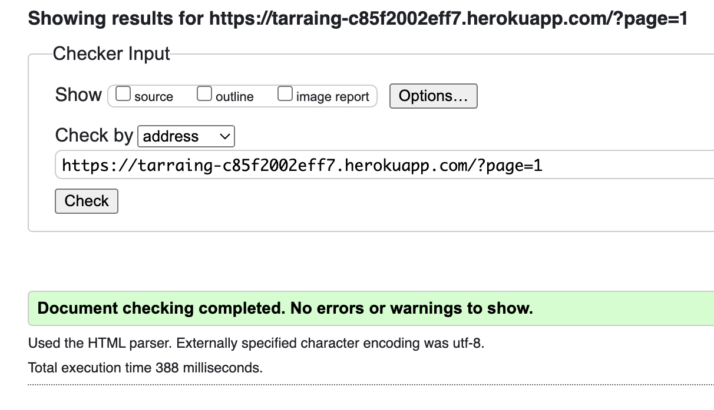

### Profile

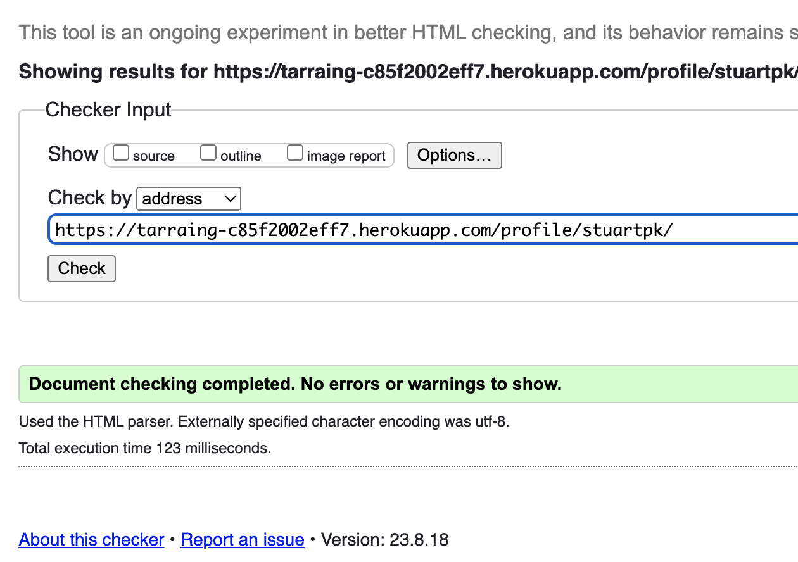

### Upload

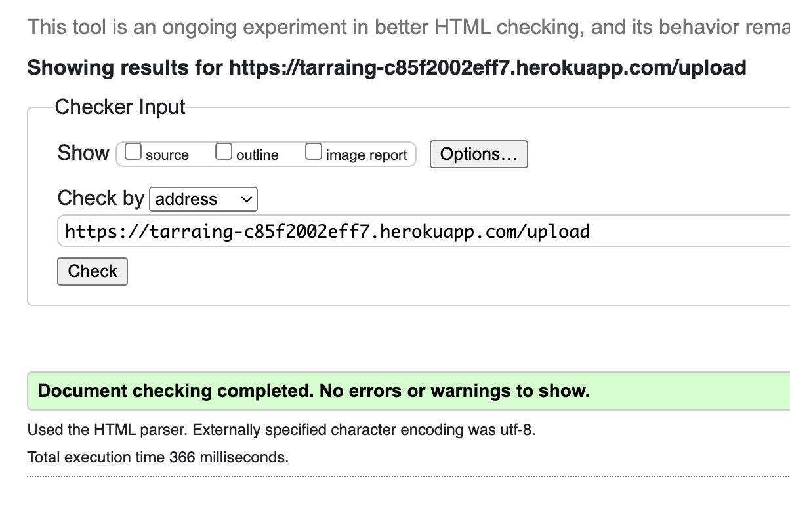

### Post detail

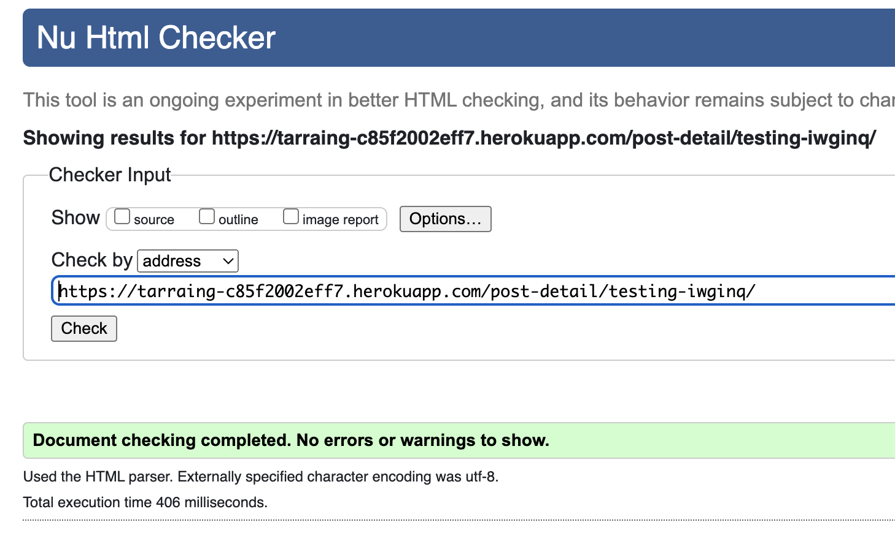

### Edit post

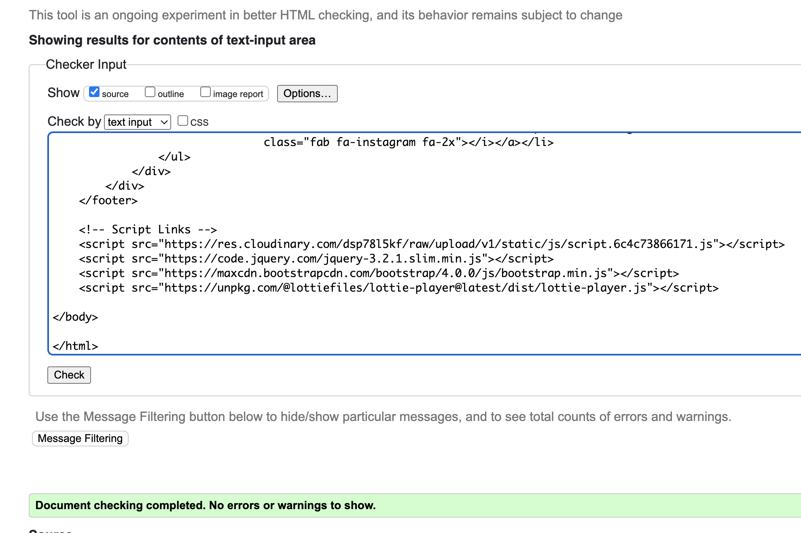

### Signup / login

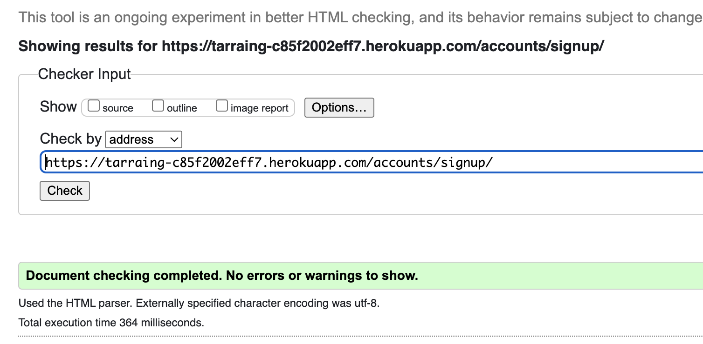
\
&nbsp;

### W3C CSS Validator

My css passed as well when it came to testing as I was frequently testing it in the validator.

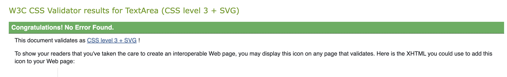
\
&nbsp;

### JS Hint

Each of my javascript code blocks passed the validator without any major issues. 

#### Confirm delete functions

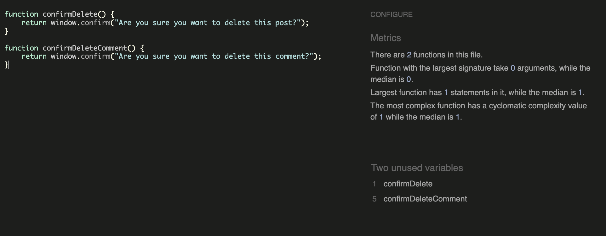
\
&nbsp;

These functions are in the js static folder and are used to ask the user to confirm deletion of posts and comments. It says they are unused but thats only because they are called in another template. Two of the scripts are placed in templates. Since they use event listeners, if I placed the javascript link in the base html, they would be called upon in all templates. This obviously caused a lot of console errors so the best way to combat this was to have them placed in their corresponding templates.

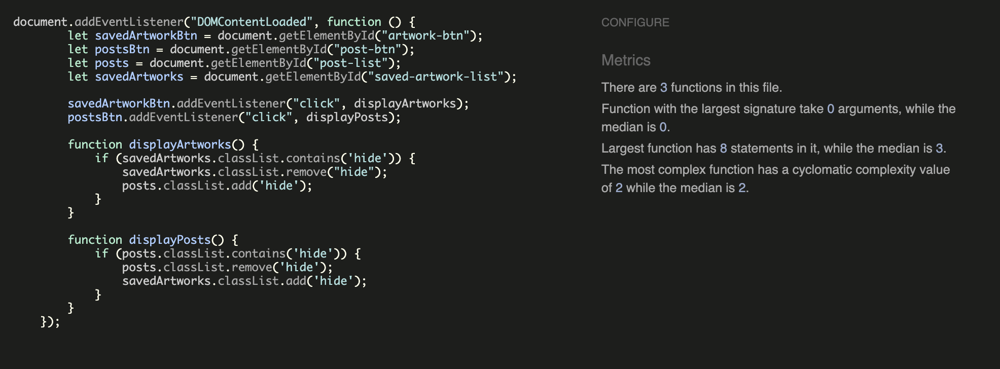
\
&nbsp;

The switch javascript passed without any issues. The only odd thing was that it would not work unless placed at the top of the template. I know this is unconventional, however it is the only way that the script would work then. This script hides and shows blocks of content which allows users to switch between their posts and saved artworks.

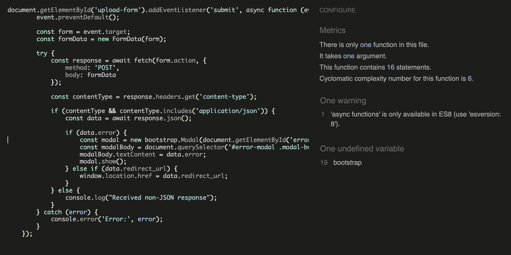

This script awaits a json response from the upload/ edit view (this script is used both in the upload template and the edit post template). It then displays a modal bootstrap error depending on the json response sent by the view.
\
&nbsp;

### CI Python checker

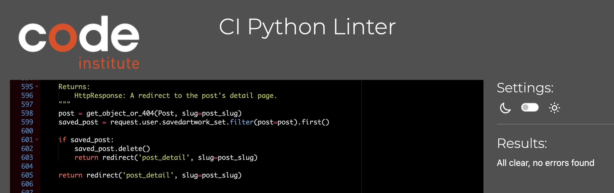

I checked all of my python files with the Code Institute python checker and recieved no issues with any of the files. The NOQA tag was used in the settings.py file as when I tried to rearrange some of the code to avoid the character limit, python would get upset.

### Lighthouse

The website performed very well when it came to the lighthouse review. It had some issues with how cloudinary was naming image files for screen readers which in my opinion can be avoided with the title of the post.

## Responsiveness 
The responsiveness of the design was manually checked using the Chrome Developer Tools for various screens.

This included:
* iPhone SE
* Pixel 5
* Samsung Galaxy S8, S20 Ultra
* iPad Air and Mini
* Galaxy Fold
* Nest Hub and Hub Max

I also opted to use the responsiveness option and checked the screens at the following width sizes:
* 350px
* 768px
* 992px
* 1400px

No issues arose, due to the simple layout of the site.
\
&nbsp;

# Bugs

## Bug 1: SVG glitches

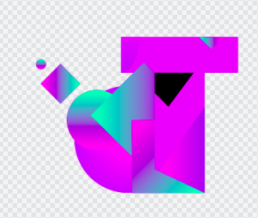
\
&nbsp;

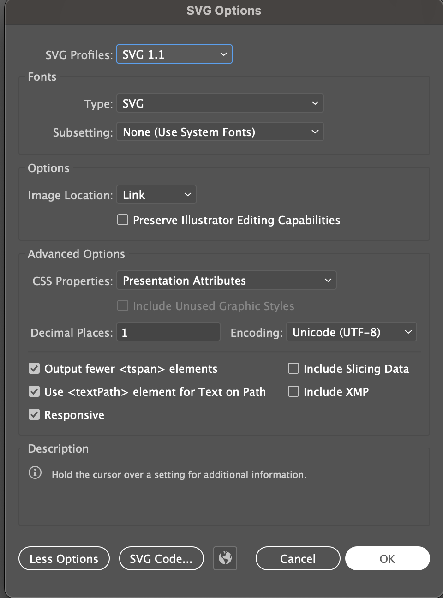
\
&nbsp;

Parts of artwork exported from illustrator would be coloured black unless I exported them in a vert particular way. Some of Adobes finest work.

## Bug 2: Placeholder issue

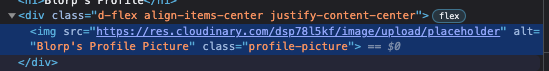
\
&nbsp;

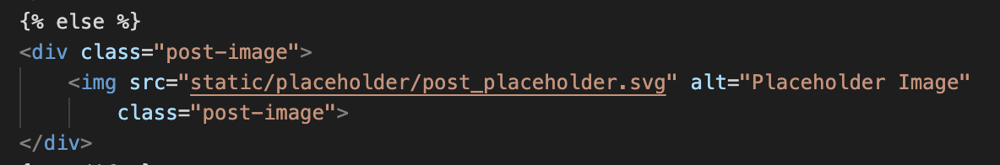
\
&nbsp;

While trying to apply placeholders to the pages. I came across an issue where the post was not displaying the cloudinary link placeholder when it did not have an image supplied by a user. This was because the model provided its own placeholder which was not matched up properly. I solved this by just linking the placeholder in the html instead.

## Bug 3:Comment duplication

\
&nbsp;

When a user would reload the page after posting a comment, the comment would get posted again. I fixed this by modifying the comment view. I made it so that the page redirects back to the post detail, otherwise the page would keep posting the same comment if the page reloaded.

## Bug 4: 

\
&nbsp;

This javascript caused some issues when it came to redirecting the user to a post detail upon successful upload. The javascript would expect a json response however would not recieve it. So I then provided a check, to see what it was recieving. This then allowed it to redirect.

## Bug 5: 

\
&nbsp;

I struggled to figure out how to select these parts of a form that was generated by django in the template. Since there was no html I had to go into the dev tools to see how to stop the parts of the form overflowing over the page.

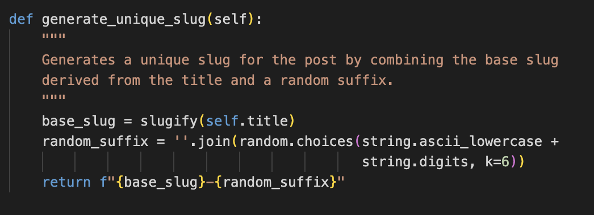
\
&nbsp;

The slugs for post details are made from the posts title. Through manual testing I realised that errors occur when changing or creating a post with the same title as another. I solved this by generating a random slug for each post. That way names can be the same.

## Known bugs

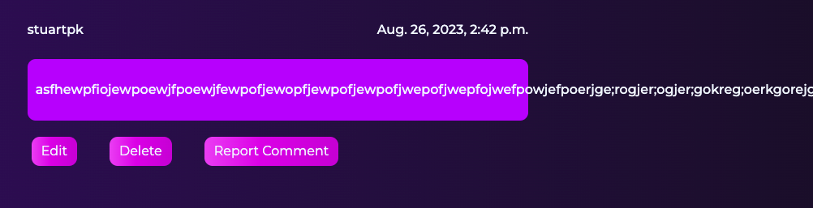
\
&nbsp;

The last bug I came cross through testing that I was not able to get rid of was to do with comments. If a user creates a comment that is one long uninterrupted string, it will extend off the side of the page. However if the comment is in just normal block sentences, it works just fine. 

# Deployment

## Create Application

1. If you don't have a Heroku account, start by signing up and logging in.
2. To establish a new application, click the "new" button located at the top right corner of the dashboard, then select "Create new app."
3. Pick a distinct name for the application, indicate your residing region, and proceed by clicking "Create App."

## ElephantSQL
1. Visit elephantsql.com, log in using GitHub, and establish a fresh instance.
2. Once your project instance is set up, copy the URL. You can store this value as an environment variable to match the DATABASES variable in settings.py.
3. Utilize pip3 install dj_database_url==0.5.0 to install the dj-database-url package version 0.5.0. This will format the URL into a Django-compatible format and necessitate an update to the requirements.txt file.

## Cloudinary

1. Set up a Cloudinary account.
2. Upload relevant project images to the "Media Library."
3. Retrieve the Cloudinary API URL from your dashboard.

## Final Repo Preparations
1. Execute necessary project migrations by entering python3 manage.py makemigrations followed by python3 manage.py migrate in the terminal.
2. Integrate a Procfile into the project, including the line web: gunicorn [project_name].wsgi:application.

## Heroku Deploy
1. Return to Heroku and navigate to the Project’s page. Open the "Settings" tab and locate the "Config Vars" section.
2. Within "Config Vars," input the following key-value pairs:
   Key = PORT : Value = 8000
   Key = SECRET_KEY : Value = Your Django Secret Key from settings.py
   Key = DATABASE_URL : Value = ElephantSQL URL (from step 5)
   Key = CLOUDINARY_URL : Value = Cloudinary API URL (from step 9)
3. Proceed to the "Deploy" tab and scroll to the GitHub deployment method.
4. Search and connect to the appropriate repository by selecting the "Connect" button.
5. Continue scrolling to the bottom of the "Deploy" Page and choose your desired deployment method. Opt for "Automatically Deploy" to 
   trigger deployment with each new code push, or manually deploy by selecting the button at the page's bottom.

Your application is now successfully deployed!

# Credits

## For Code Help and Advice
* [Harry Dhillon](https://github.com/Harry-Leepz)

## Helpful Resources

## For Content and Code

